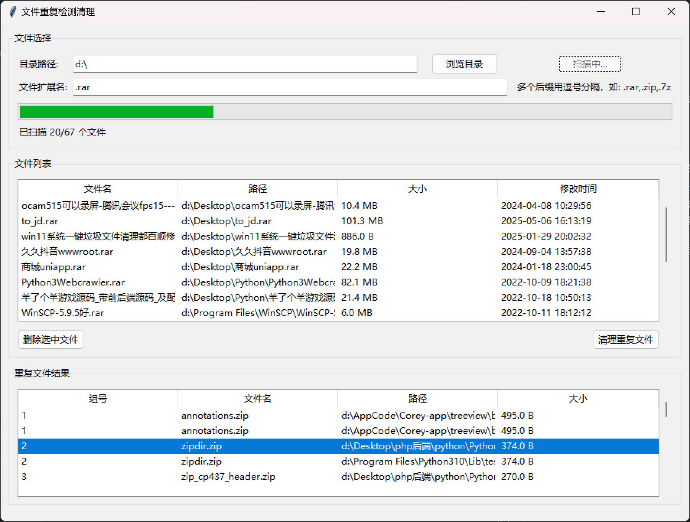

# 文件重复检测清理

一个使用Python和Tkinter开发的GUI应用程序，用于检测和清理重复文件。

## 功能特点

1. 手动添加目录（支持子目录和隐藏目录）
2. 文件扩展名筛选（支持多个后缀输入，如 .rar,.zip,.7z）
3. 扫描目录并自动检测重复文件（一体化操作）
4. 进度条显示扫描和检测进度
5. 清理重复文件（保留每组中的第一个文件）
6. 图形化界面显示文件列表和重复文件结果
7. 支持删除选中的文件
8. 优化的性能，减少资源占用

## 运行环境

- Python 3.6 或更高版本
- Tkinter（通常随Python一起安装）
- Windows、macOS或Linux操作系统

## 安装和运行

### 方法一：使用命令行运行
1. 克隆或下载此项目
2. 进入项目目录
3. 运行以下命令启动应用程序：
   ```
   python file_duplicate_detector.py
   ```

### 方法二：使用批处理文件运行（仅Windows）
1. 双击运行 `run_detector.bat` 文件
2. 或者在命令提示符中执行：
   ```
   run_detector.bat
   ```

## 使用说明

1. **选择目录**：
   - 点击"浏览目录"按钮选择要扫描的目录
   - 或在输入框中手动输入目录路径

2. **设置文件扩展名筛选器**：
   - 在"文件扩展名"输入框中输入要筛选的文件扩展名
   - 支持多个后缀输入，用逗号分隔（如 .rar,.zip,.7z）
   - 如果留空，则扫描所有文件（不推荐大目录）

3. **扫描并检测重复文件**：
   - 点击"扫描并检测重复文件"按钮开始扫描
   - 程序会递归扫描目录及其子目录中的所有符合条件的文件
   - 扫描完成后自动检测重复文件
   - 进度条会显示扫描和检测的进度

4. **查看文件列表**：
   - 添加的文件会显示在文件列表区域，包括文件名、完整路径、文件大小和修改时间
   - 可以选择一个或多个文件后点击"删除选中文件"按钮从列表中移除

5. **查看重复文件结果**：
   - 重复文件会按组显示在结果区域
   - 每组重复文件都有相同的组号

6. **清理重复文件**：
   - 点击"清理重复文件"按钮
   - 程序会保留每组重复文件中的第一个文件，删除其余文件
   - 清理完成后，文件列表会自动更新


## 软件界面


## 技术支持

- **开发者：速光网络软件开发**
- 官网：suguang.cc
- 联系电话/微信：15120086569
- 抖音号：dubaishun12

## 版权信息

Copyright © 2025 速光网络软件开发. All rights reserved.

---
*关注我们的抖音账号获取最新更新和技术支持！*